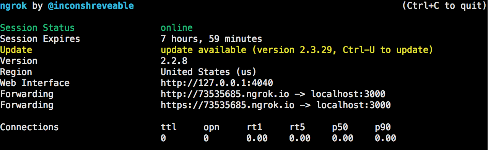
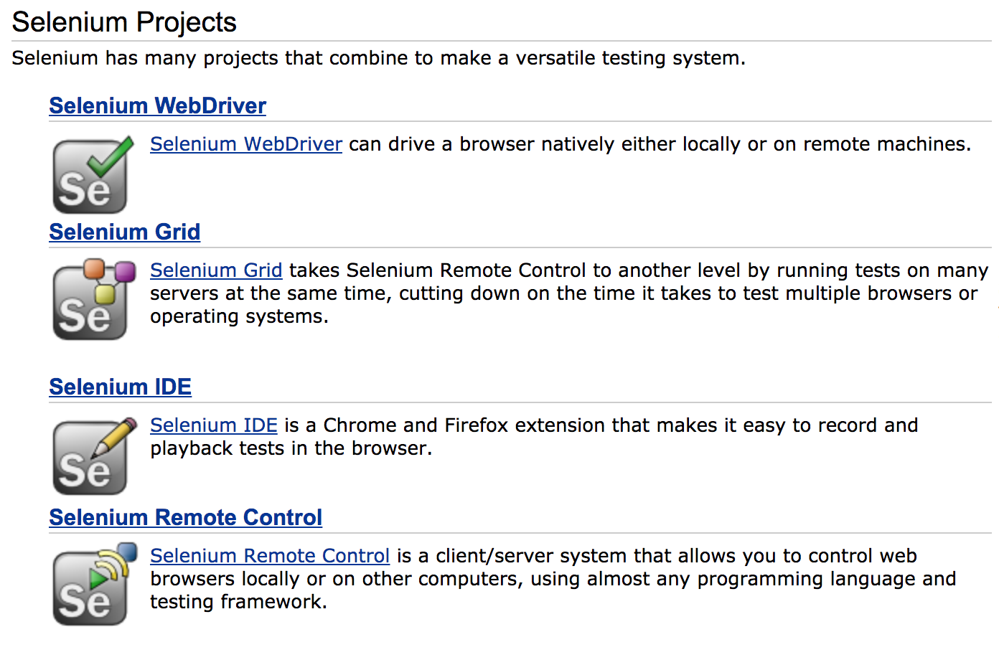
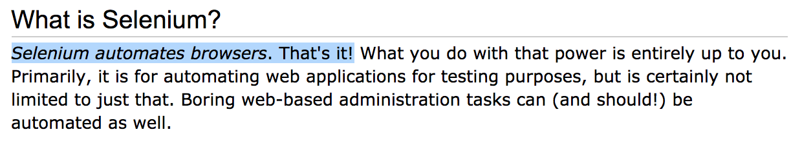

# Lab : Gotta catch them all!

__Table of Contents__
- [Setup](#setup)
- [Chapter 1 - Unit Testing](#chapter-1--unit-testing)
    - [Exercise 1.1: Hello Pikachu](#-execise-11-hello-pikachu)
    - [Exercise 1.2: Using Should Syntax](#-execise-12-using-should-syntax)
    - [Exercise 1.3: Using Expect Syntax](#-execise-13-using-expect-syntax)
    - [Exercise 1.4: Testing Exceptions](#-execise-14-using-assertthrows-to-test-exceptions)
    - [Exercise 1.5: Testing Promises](#-execise-15-testing-promises)
    - [Exercise 1.6: Testing Callbacks](#-execise-16-testing-callback)
    - [Exercise 1.7: Using Hooks to Setup and Teardown Tests](#-execise-17-writing-hooks-to-setup-and-teardown-tests)
- [Chapter 2 - API Testing](#chapter-2--api-testing)
    - [Exercise 2.1: Writing an API tests](#-execise-21-writing-an-api-test)
    - [Exercise 2.2: Resetting the web server between tests](#-execise-22-resetting-the-web-server-between-tests)
    - [Exercise 2.3: Seeding the test database between tests](#-execise-23-seeding-the-test-database-between-tests)
- [Chapter 3 - UI Testing](#chapter-3--end-to-end-acceptance-testing)
    - [Exercise 3.1: Testing with UI-licious](#-execise-31-testing-with-ui-licious)
    - [Exercise 3.2: Testing with Webdriver.io](#-execise-32-testing-with-webdriverio)
    - [Exercise 3.3: Integrating with Applitools](#-execise-33-integrating-with-applitools)
- [Solutions](#solutions)
  - [Exercise 1.1](#-execise-11-hello-pikachu-1)
  - [Exercise 1.2](#-execise-12-using-should-syntax-1)
  - [Exercise 1.3](#-execise-13-using-expect-syntax-1)
  - [Exercise 1.4](#-execise-14-using-assertthrows-to-test-exceptions-1)
  - [Exercise 1.5](#-execise-15-testing-promises-1)
  - [Exercise 1.6](#-execise-16-testing-callback-1)
  - [Exercise 1.7](#-execise-17-writing-hooks-to-setup-and-teardown-tests-1)
  - [Exercise 2.1](#-execise-21-writing-an-api-test-1)
  - [Exercise 2.2](#-execise-22-resetting-the-web-server-between-tests-1)
  - [Exercise 2.3](#-execise-22-resetting-the-web-server-between-tests-1)
  - [Exercise 3.1](#-execise-31-testing-with-ui-licious-1)
  - [Exercise 3.2](#-execise-32-testing-with-webdriverio-1)
  - [Exercise 3.3](#-execise-33-integrating-with-applitools-1)

#  Introduction

Welcome to the Pokedex!

This (ExpressJS) web application allows you to view information about all the pokemons currently known in the world.

Let's add some tests to catch them (bugs) all!

In this lab, we're going to write automate tests for this application:

-   Chapter 1: Unit testing with [Mocha](https://mochajs.org) and [Chai](https://www.chaijs.com/)
-   Chapter 2: API testing with [Chai-http](http://dareid.github.io/chakram/)
-   Chapter 3: End-to-end acceptance testing with [webdriver.io](https://webdriver.io/) and [UI-licious](https://uilicious.com)
<!-- -   Chapter 4: Integrating with CI/CD and practicing TDD -->

#  Setup

##  Setting up the project

👉 Fork this repository (https://github.com/shiling/testing-zero-to-hero) and clone it to your fork of the repository

👉 Run `npm install` to to install the project dependencies.

##  Setting up tests for the project

Now, let's setup the project to run some tests.

👉 Create a folder called `/tests` for your tests.

###  What is Mocha?

We are going to setup Mocha to run our tests.

[Mocha](https://mochajs.org) is a javascript testing framework, it helps you to manage the setup, execution, teardown, and reporting of your tests.

###  Setting up Mocha

👉 Install [Mocha](https://mochajs.org).

```
npm install mocha --save-dev
```

👉 Set up your `test` script in `package.json` like this:

```json
{
    "scripts": {
        "test": "mocha \"./tests/**/*.js\" --exit"
    }
}
```

This will tell Mocha to execute all tests under the `/tests` folder (in alphabetical order).

The `--exit` flag forces mocha to exit once all the tests are complete, even if other resources such as the web server or db connections are still alive (but of course, you should try to close them during the teardown process.)

#  Chapter 1 : Unit Testing

Let's start with something simple - unit tests.

##  What is unit testing?

Unit tests are the smallest kinds of functional tests, and are designed to test a single method.

A unit test should test if the method produces the correct output given certain inputs.

###  💎 Execise 1.1: Hello Pikachu

In this exercise, we're going to try writing our first unit test for the `Pokemon` class in `models/Pokemon.js`. Let's test the `setName` method.

👉 Create the file `1_pokemon.js` in the `/tests/1_unit_tests/` folder.

👉 Import the Pokemon class:

```javascript
const Pokemon = require("../../models/Pokemon")
```

👉 Use `describe` to create a test suite for the `Pokemon` class and for the `setName` method, to group related tests:

```javascript
describe("Pokemon", function() {
    describe("#setName()", function() {
        // We'll write our test cases here
    })
})
```

👉 Use `it` to define the test `should set name when passed non-empty string`:

```javascript
describe("Pokemon", function() {
    describe("#setName()", function() {
        // Test Case 1
        it("should set name when passed non-empty string", function() {
            // Steps to perform your test here:
        })
    })
})
```

💡Tip: Just a like any other scientific test, a good test validates only one hypothesis at a time. A good software test should test **exactly one** requirement and validate the expected behavior(s) of the application.

👉 Write the steps to perform `setName` method given a non-empty string:

```javascript
it("should set name when passed non-empty string", function() {
    // Steps to perform your test here:

    // Create a pokemon, and set the name
    let pokemon = new Pokemon()
    pokemon.setName("Pikachu")
})
```

The test is not complete without assertions to validate the output.

NodeJS comes with an assertion library built-in - ["assert"](https://nodejs.org/api/assert.html).

👉 Import the "assert" module

```javascript
const assert = require("assert")
```

👉 Now, let's add an assertion to make sure that the name of the pokemon is equal to the value we just set:

```javascript
// Test Case 1
it("should set name when passed non-empty string", function() {
    // Steps to perform your test here:

    // Create a pokemon, and set the name
    let pokemon = new Pokemon()
    pokemon.setName("Pikachu")

    // After setting the name, we must make sure that the name is "Pikachu"
    assert.equal(pokemon.name, "Pikachu")
})
```

👉 When you are done, run `npm tests` in your console to run your tests.


##  Using the Chai assertion library

The build-in "assert" library that comes with NodeJS provides you a basic assertion commands, but is otherwise very limited _(and unfortunately has bugs itself... either that, or the documentation isn't very clear and I'm using it wrongly half the time...)_.

Mocha works with assertion libraries such as [Chai](https://www.chaijs.com/) which provides the syntax for writing the tests.

Chai is an assertion library on steroids, that lets you provides BDD-style `should` and `expect` syntax, as well as a more powerful `assert` library.

Chai also supports a lot of [plugins](https://www.chaijs.com/plugins/) to help you perform other useful assertions:

-   [chai-http](https://www.chaijs.com/plugins/chai-http/) for testing http apis (we'll come to this later)
-   [chai-json-schema](https://www.chaijs.com/plugins/chai-json-schema/) for testing json objects against a schema
-   [chai-dom](https://www.chaijs.com/plugins/chai-dom/) for testing DOM elements
-   [chai-url](https://www.chaijs.com/plugins/chai-dom/) for testing URLs
-   [chai-file](https://www.chaijs.com/plugins/chai-files/) for testing files
-   [chai-doge](https://www.chaijs.com/plugins/chai-doge/) wow, very doge-style language chains for Chai, much silly

###  💎 Execise 1.2: Using `should` syntax

👉 Install Chai:

```bash
npm install chai --save-dev
```

In this exercise, let's try out Chai's `should` syntax.

Import Chai's `should` library:

```javascript
const should = require("chai").should() // actually call the function
```

_Note that you need to actually call the should function to import it._

`should` extends the Object class to allow you to write assertions like this:

-   Type assertions : `pokemon.name.should.be.a("string")`
-   Value assertions : `pokemon.name.should.be.equal("Pikachu")`
-   Length assertions : `pokemon.types.should.have.lengthOf(2)`
-   and [more...](https://www.chaijs.com/api/bdd/)

👉 Write the previous test using the `should` syntax.

###  💎 Execise 1.3: Using `expect` syntax

In this exercise, let's try out Chai's `expect` syntax.

Import Chai's `expect` library:

```javascript
const expect = require("chai").expect
```

`expect` allows you to write assertions like this:

-   Type assertions : `expect(pokemon.name).to.be.a("string")`
-   Value assertions : `expect(pokemon.name).to.be.equal("Pikachu")`
-   Length assertions : `expect(pokemon.types).to.have.lengthOf(2)`
-   and [more...](https://www.chaijs.com/api/bdd/)

👉 Write the previous test using the `expect` syntax.

##  Negative testing

It's important to also test negative scenarios, as user can make mistakes, and the application is expect to gracefully handle these accidents by showing appropriate errors to help users identify the problem and correct themselves.

###  💎 Execise 1.4: Using `assert.throws` to test exceptions

👉 Using Chai's `assert.throws`, test if an appropriate error is thrown when an empty string is passed to the `setName` method.

👉 Remember add `const assert = require("chai").assert` to import Chai's assert library.

##  Testing asynchronous functions (callbacks and promises)

Mocha supports testing asynchronous functions like callbacks and promises.

When running asynchronous tests with callbacks, you need tell Mocha when the test is complete by invoking a callback (usually called `done`). Passing an error to the `done` callback will cause the test to fail.

```javascript
it("should make sandwich", function(done) {
    chef.makeSandwich(function(err, sandwich) {
        if (err) {
            done(err)
        } else {
            expect(sandwich).to.exist
            done()
        }
    })
})
```

To handle promises, you can simply return the promise, and Mocha will automatially wait for the Promise to resolve.

```javascript
it("should make sandwich", function() {
    return chef
        .makeSandwich()
        .then((sandwich) => {
            expect(sandwich).to.exist
        })
        .catch(function(err) {
            throw err
        })
})
```

Alternatively, you can use the `async/await` syntax, which can make the test neater:

```javascript
it("should make sandwich", async function() {
    const sandwich = await chef.makeSandwich
    expect(sandwich).to.exist
})
```

###  💎 Execise 1.5: Testing promises

For the following exercises, let's test the `Pokedex` which provides methods to store information about our pokemons to a database. All of the Pokedex methods are asynchronous, and returns Promises.

In this lab, we'll be using [knex](https://knexjs.org) to setup and seed the database for development and test environments.

👉 For now, run the commands below in your console to setup the test database:

```bash
node_modules/.bin/knex migrate:up --env test
```

👉 

👉 Let's test the `Pokedex.save()` method, which saves a pokemon to the database. If the pokemon does not have an id, the save method will set the id on the pokemon object. The `Pokedex.save()` method returns a Promise.

👉 Use `async/await` to wait for the promise returned by the `Pokedex.save` method to resolve.

👉 If you have extra time, write tests for:

-   `Pokedex.save` : Update an existing pokemon in the pokedex
-   `Pokedex.get` : Get a pokemon by ID
-   `Pokedex.getByName` : Get a pokemon by name
-   `Pokedex.find` : Find pokemons by attributes

###  💎 Execise 1.6: Testing callback

For the purpose of illustrating how to test callbacks, a callback version of `save()` is implemented as `save_callback()`.

👉 Write a test for `Pokedex.save_callback`

##  Hooks

Mocha provides [hooks](https://mochajs.org/#hooks) for us to run code before and after tests.

These are useful for setting up and resetting the test environment between tests. We want to do this in order to ensure that the tests are not affected by the preceding tests. A good test is a test that is repeatable.

Available hooks:

-   `before(function(){})` - Runs once before all the tests in a `describe` block
-   `beforeEach(function(){})` - Runs before each the tests in a `describe` block
-   `afterEach(function(){})` - Runs after each the tests in a `describe` block
-   `after(function(){})` - Runs once after all the tests in a `describe` block

Hooks handle asychronous codes (promises and callbacks) like regular test cases.

###  💎 Execise 1.7: Writing hooks to setup and teardown tests

👉 Write a `beforeEach` hook to clear the database between tests.

Hint: Just drop the table, and create it again with the code below:

```javascript
return pokedex.dropTable().then(() => {
    return pokedex.createTable()
})
```

👉 Write a `before` hook to connect to the database

👉 Write a `after` hook to close the database (it's always good to clean up before you leave!)

#  Chapter 2 : API Testing

Now, let's move one layer up and work on testing out APIs.

##  Setup

In this lab, we'll be using [knex](https://knexjs.org) to setup and seed the database for development and test environments.

👉 For now, run the commands below in your console to setup and seed the database for development:

```bash
node_modules/.bin/knex migrate:up --env development
node_modules/.bin/knex seed:run --env development
```

We'll come to setting up and seeding the database for test environments in later exercises.

👉 Start the server:

```bash
npm start
```

The application will be loaded at [http://localhost:3000](http://localhost:3000)

***Run these commands to prepare your test database:***

```bash
node_modules/.bin/knex migrate:up --env test
```

##  Writing API tests

Let's test the `GET /api/pokemons` API which lists the pokemons in the database, and allows you to search for pokemons by attributes.

###  💎 Execise 2.1: Writing an API test

We're going to use the [`chai-http`](https://www.chaijs.com/plugins/chai-http/) plugin which allows us to test http requests.

👉 Install `chai-http`

```bash
npm install chai-http --save-dev
```

👉 Import and register the plugin

```javascript
const chai = require("chai")
const expect = require("chai").expect
const chaiHttp = require("chai-http")
chai.use(chaiHttp)
```

👉 Write a test to retrieve all the pokemons using the `GET /api/pokemons` API, with the following assertions:

-   Assert that the response has a status of 200
-   Assert that the response has a "content-type" header of "application/json; charset=utf-8"
-   Assert that the response body is a json
-   Assert that the response body is an array
-   Assert that the response body is an array with 166 pokemons
-   Assert that the name of the first pokemon is "Bulbasaur"
    💡 Hint: You'll need [📖 this](https://www.chaijs.com/plugins/chai-http/)

👉 Write a test to add a pokemon using the `POST /api/pokemons/add` API.

##  Setting up the environment for API testing

Ideally, we don't want to be running our tests on production, and polluting it with test data.

Let's setup our tests to run on a test environment with a web server and a database, and reset the environment between tests.

###  💎 Execise 2.2: Resetting the web server between tests

The web server can contain persistant data which means it is possible for tests to be affected by tests that ran previously. To ensure that the test environment is the same between tests, we should start and stop the web server between tests.

You can do this yourself using hooks, like this:

```javascript
const app = require("../app")

beforeEach(function(done) {
    // start the server before running the tests
    server = app.listen(3000, done)
})

afterEach(function(done) {
    // close the server after running the tests
    server.close(done)
})
```

Thankfully, `chai-http` already has this behavior built-in, and you can simply change your `chai.request("http://localhost:3000")` to `chai.request(app)` which will automatically start the server (by calling `listen`) before the request and shut down the server (by calling `close`) after the request.

👉 Use `chai.request(app)` to start and stop the webserver between tests.

###  💎 Execise 2.3: Seeding the test database between tests

Ideally, we want to use another database for our test environment to avoid polluting production with test data, and to also be able to reset the database between tests.

In this application, we use [knex](https://knexjs.org) to perform queries, migrations, and to seed our database.

The migration files are already setup under `/migration` which runs the scripts to rollback and to update the schema of our database.

For example:

```javascript
exports.up = function(knex, Promise) {
    return knex.schema.createTable("pokemons", function(table) {
        table.increments("id")
        table.string("name").unique()
        table.json("types")
        table.integer("hp")
        table.integer("attack")
        table.integer("defense")
        table.integer("sp_attack")
        table.integer("sp_defense")
        table.integer("speed")
        table.integer("generation")
        table.boolean("legendary")
        table.timestamps()
    })
}

exports.down = function(knex, Promise) {
    return knex.schema.dropTableIfExists("pokemons")
}
```

The seed files for each environment are already setup under `/seeds` which runs scripts to seed the database in the respective environments. The seed files are ran in alphabetically order. `1_seed_pokemon.js` runs a script to read the `Pokemon.csv` in the same folder and populate the database.

-   For the production environment, we are adding 800 pokemons from Generation 1 to 6.
-   For the test environment, we are adding just 166 pokemons from Generation 1, which contains 6 legendary pokemons.

The configurations for different environments are defined in `knexfile.js`.

👉 Add `process.env.NODE_ENV = "test"` to the start of your test to ensure that the test configurations are always selected when you run the test.

👉 To reset and seed the database between tests, add these hooks to your tests:

```javascript
let knex

before(async function() {
    const config = require("../knexfile.js")[process.env.NODE_ENV]
    knex = require("knex")(config) // connect
    await knex.migrate.rollback(true) // rollback the schema, this will also destroy all data
    await knex.migrate.latest() // migrate the schema to the latest version
})

beforeEach(async function() {
    await knex.seed.run() // seed the test data
})

after(async function() {
    await knex.destroy() // close the connection
})
```

👉 Order the tests for the `POST /api/pokemons/add` API before the `GET /pokemons` API, and run your tests. The test data should be reset when the `GET /pokemons` API tests are ran.

#  Chapter 3 : End-to-end Acceptance Testing

##  What is acceptance testing?

A formal way of defining acceptance testing is to say that verifying that a software met business requirements.

I think a better way and more **relatable** way to describe acceptance testing is that:

Acceptance testing is verify that the application works for the **user**.

To perform acceptance testing, we need to simulate user stories, which should include:

-   An **objective** that a user wants to achieve with the application,
-   A series of actions that the user performs, which can be:
    -   And a **happy** flow where a user performs valid actions
        -   with assertions to validate that the application state and view is updated correctly
    -   Or a **negative** flow where a user makes mistake (it's very human to do so!)
        -   with assertions to validate that appropriate messages are shown to help the user recover from the error

##  UI-licious

###  💎 Execise 3.1: Testing with UI-licious

We can use GUI automation tools to automate acceptance testing.

The easiest way to test your web application is with [UI-licious](https://uilicious.com). ;)

👉 Start the server:

```
npm start
```

The application will be loaded at [http://localhost:3000](http://localhost:3000).

👉 Using ngrok to temporarily expose your localhost application:

```
npm install ngrok -g
ngrok http 3000
```

This will install and then start ngrok to connect to your localhost application at port 3000. ngrok will provide a url to allow public access to your localhost application, which as seen in the screenshot is `http://73535685.ngrok.io`.



👉 (Alternative to ngrok) Using serveo.net to expose your localhost application via SSH

```
ssh -R 80:localhost:3000 serveo.net
```

You will see something like the following

```
Forwarding HTTP traffic from https://tectum.serveo.net
Press g to start a GUI session and ctrl-c to quit.
```

This has the advantage of not needing another NPM install globally, and better performance. It however uses SSH which maybe block in certain corporate environments.

👉 Go to https://snippets.uilicious.com/ to access the free edition of UI-licious. It's like CodePen, but for testing.

👉 Write a test to:

-   Search for "Pikachu"
-   Validate that the results shows one Pokemon
-   Validate that the result is a Pikachu

##  Doing it yourself

###  The WebDriver Protocol and Selenium

We can use GUI automation tools to automate acceptance testing. In the case for browser applications, the standard is to use the WebDriver protocol which is the specs defined by WC3 for browser automation.
Browser vendors implement drivers that support the protocol according to the specs. Or at least they are supposed to. But like printer drivers, vendors can't seem to follow the spec, and everyone seems to be doing their own thing, so there's a lot of missing implementations and inconsistencies.

...list of browser drivers...

What is **Selenium**?

Selenium ≠ Webdriver. (Just like Web ≠ Internet.)

Going along with the printer driver analogy, the Selenium WebDriver is like the System Print Dialog, it is an interface to the browser automation drivers. It is a library that provides a layer of abstraction so that it's easier for you to connect to different browsers (just like how your computer can print to printers from different vendors).

Don't get this confused with the Selenium Grid, and Selenium IDE, which are other projects:



The Selenium Grid is a server that manages the pool of connections of browser sessions.

The Selenium IDE is a Chrome and Firefox extension that is basically a macro-recording tool.

What is **Selenium** again?



Exactly as it is written on the Selenium website. Selenium is a tool for automating the browser. It is not particulary designed for testing, while that is the primary use case, but it can be use for doing other things like web scrapping.

That said, Selenium really isn't the best tool for testing, it's like using a butter knife for a surgery - it works, kind of, but it's really unweldy.

There's a lot of frameworks built on top of Selenium that help make testing easier:

-   Javascript testing libraries:
    -   [UI-licious](https://uilicious.com)
    -   [Webdriver.io](https://webdriver.io/)
    -   [NightmareJS](https://github.com/segmentio/nightmare)
    -   [CodeceptJS](https://codecept.io/)

###  💎 Execise 3.2: Testing with webdriver.io

####  Setting up selenium 

👉 Install selenium-standalone

```
npm install selenium-standalone --save-dev
```

👉 Run the following to install the necessary drivers
```
./node_modules/.bin/selenium-standalone install
```

####  Setting up webdriverio 

👉 Install wdio which is the test runner for webdriver.io

```
npm install @wdio/cli @wdio/local-runner @wdio/mocha-framework @wdio/selenium-standalone-service @wdio/spec-reporter @wdio/sync selenium-standalone --save-dev
```

👉 Copy "wdio.conf.sample.js" to "wdio.conf.js"

👉 Create "/tests/3_e2e_tests" folder for e2e tests.

####  Writing your test

👉 Same as the previous exercise, write a test to:
- Search for "Pikachu"
- Validate that there is one result
- Validate that there is the first result has the title "Pikachu"

👉 Run your tests using this command:
```
npm run test:e2e
```

👉 (Optional) Take screenshots with `browser.takeScreenshot()` and save it to a file

##  Visual Testing

> TODO

###  💎 Execise 3.3: Integrating with Applitools

> TODO

<!-- #  Chapter 4: Integrating with CI / CD, and practicing TDD

###  💎 Execise 4.1:

####  Deploying to Netlify (Staging)

We'll be using [Netlify](https://netlify.com) to deploy our application. Netlify comes with CI/CD built in, one of the cool features they have is that when every you push a change to a branch or create a PR, Netlify will deploy a "staging" URL for you to preview the changes.

👉 Install Netlify:

```
npm install netlify-cli -g
```

👉Login to Netlify (You need to have a Netlify account)

```
netlify login
```

👉 Initialise your Netlify website.

```
netlify init
```

Netlify CI/CD is now configured!

👉 Make some changes to the application, e.g. add a "Edit Pokemon" form or a "Add Pokemon" form and some tests

👉 Create a PR -->

---

#  What is a good test?

A good test covers only a single hypothesis (a software requirement).

A good test has assertions to validate the hypothesis.

A good test is deterministics / repeatable, i.e. given the same environment and inputs, the output is the same.

---

#  Alternatives

##  Unit test frameworks

-   Mocha : Basic stuff, but really flexible, intended for plug and play with other assertion libraries
-   Jasmine : Batteries included (bdd-style expect assertions are built-in)

##  Assertion Libraries:

-   NodeJS's built in assert module
    -   Not very rich in terms of APIs, and some issues with exception assertion
-   should.js - just the bdd-style `should` syntax
-   expect.js - just the bdd-style `expect` syntax
-   Chai - supports `should`, `expect` and `assert`.

##  Assertion Libraries for testing REST APIs:

-   Chakram: Pretty nice syntax too (though for the purpose of the workshop, )
-   chai-http

---

#  FYI

###  What's BDD?

One common issue with unit tests is

BDD stands for Behavior-Driven Development, which is a style of writing tests in a way that describes how the application **should** behave or is **expected** to behave, instead of describing how it is implemented.


---

#  Solutions

##  💎 Execise 1.1: Hello Pikachu

```javascript
const Pokemon = require("../models/Pokemon")
const assert = require("assert")

describe("Pokemon", function() {
    describe("#setName()", function() {
        it("should set name when value is present", function() {
            var pokemon = new Pokemon()
            pokemon.setName("Pikachu")
            assert.equal(pokemon.name, "Pikachu")
        })
    })
})
```

##  💎 Execise 1.2: Using `should` syntax

```javascript
it("should set name when value is present", function() {
    var pokemon = new Pokemon()
    pokemon.setName("Pikachu")
    pokemon.should.have.property("name", "Pikachu")
})
```

##  💎 Execise 1.3: Using `expect` syntax

```javascript
it("should set name when value is present", function() {
    var pokemon = new Pokemon()
    pokemon.setName("Pikachu")
    expect(pokemon.name).to.equal("Pikachu")
})
```

##  💎 Execise 1.4: Using `assert.throws` to test exceptions

```javascript
it("throw error when value is empty", function() {
    assert.throws(function() {
        var pokemon = new Pokemon()
        pokemon.setName("")
    }, "name cannot be empty")
})
```

##  💎 Execise 1.5: Testing promises

```javascript
const Pokemon = require("../../models/Pokemon")
const Pokedex = require("../../db/Pokedex")
const expect = require("chai").expect

describe("Pokedex", function() {
    // connect to the database
    let pokedex = new Pokedex()
    pokedex.connect("./storage/test.sqlite3")

    describe("#save()", function() {
        it("should add pokemon", async function() {
            // Create a Pokemon
            let pokemon = new Pokemon()
            pokemon.setName("Pikachu")
            pokemon.setTypes(["Electric"])

            // Save to the Pokedex
            await pokedex.save(pokemon)

            // Validate that the pokemon now has an id
            expect(pokemon.id).to.be.a("number")
        })
    })
})
```

##  💎 Execise 1.6: Testing callback

```javascript
describe("#save_callback()", function() {
    it("should add pokemon", function(done) {
        // Create a Pokemon
        let pokemon = new Pokemon()
        pokemon.setName("Pikachu")
        pokemon.setTypes(["Electric"])

        // Save to the Pokedex
        pokedex.save_callback(pokemon, function(err) {
            if (err) {
                return done(err)
            }

            // Validate that the pokemon now has an id
            expect(pokemon.id).to.be.a("number")
            return done()
        })
    })
})
```

##  💎 Execise 1.7: Writing hooks to setup and teardown tests

```javascript
describe("Pokedex", function() {
    let pokedex = new Pokedex()

    before(function() {
        return pokedex.connect("./storage/test.sqlite3")
    })

    beforeEach(function() {
        return pokedex.dropTable().then(() => {
            return pokedex.createTable()
        })
    })

    after(function() {
        return pokedex.close()
    })

    // Test cases...
})
```

##  💎 Execise 2.1: Writing an API test

```javascript
describe("/api/pokemon/get", function() {
    it("should retrieve all pokemons", function() {
        // promise
        return chai
            .request("http://localhost:3000")
            .get("/pokemons")
            .send()
            .then(function(res) {
                expect(res).to.have.status(200)
                expect(res).to.have.header("content-type", "application/json; charset=utf-8")
                expect(res).to.be.json
                expect(res.body).to.be.a("Array")
                expect(res.body).to.have.lengthOf(166) // 166 pokemons
                expect(res.body[0].name).to.be.equal("Bulbasaur") // first pokemon should be bulbasaur
            })
            .catch(function(err) {
                throw err
            })
    })
})

describe("/api/pokemons/add", function() {
    it("should add pokemon", async function() {
        const res = await chai
            .request(app)
            .post("/api/pokemons/add")
            .send({
                name: "MewThree",
                hp: "999",
                attack: "999",
                defense: "999",
                sp_attack: "999",
                sp_defense: "999",
                speed: "999",
                legendary: true
            })
        expect(res).to.have.status(200)
        expect(res).to.have.header("content-type", "application/json; charset=utf-8")
        expect(res).to.be.json
        expect(res.body.name).to.be.equal("MewThree")
    })
})
```

##  💎 Execise 2.2: Resetting the web server between tests

```javascript
describe("API tests", function() {
    const app = require("../app")
    describe("/api/pokemon/get", function() {
        it("should retrieve all pokemons", function() {
            // promise
            return chai
                .request(app) // 👈 change this
                .get("/api/pokemons")
                .send()
                .then(function(res) {
                    expect(res).to.have.status(200)
                    expect(res).to.have.header("content-type", "application/json; charset=utf-8")
                    expect(res).to.be.json
                    expect(res.body).to.be.a("Array")
                    expect(res.body).to.have.lengthOf(166) // 166 pokemons
                    expect(res.body[0].name).to.be.equal("Bulbasaur") // first pokemon should be bulbasaur
                })
                .catch(function(err) {
                    throw err
                })
        })
    })
})
```

###  💎 Execise 2.3: Seeding the test database between tests
```javascript
process.env.NODE_ENV = "test"

const chai = require("chai")
const expect = require("chai").expect
const chaiHttp = require("chai-http")
chai.use(chaiHttp)

describe("API tests", function() {
    
    const app = require("../../app")
    
    let knex
    before(async function() { // 👈 Add this
        const config = require("../../knexfile.js")[process.env.NODE_ENV]
        knex = require("knex")(config) // connect
        await knex.migrate.rollback(true) // rollback the schema, this will also destroy all data
        await knex.migrate.latest() // migrate the schema to the latest version
    })

    beforeEach(async function() { // 👈 Add this
        await knex.seed.run() // seed the test data
    })

    after(async function() { // 👈 Add this
        await knex.destroy() // close the connection
    })

    // POST methods
    describe("/api/pokemons/add", function() {
        it("should add pokemon", async function() {
            const res = await chai
                .request(app)
                .post("/api/pokemons/add")
                .send({
                    name: "MewThree",
                    hp: "999",
                    attack: "999",
                    defense: "999",
                    sp_attack: "999",
                    sp_defense: "999",
                    speed: "999",
                    legendary: true
                })
            expect(res).to.have.status(200)
            expect(res).to.have.header("content-type", "application/json; charset=utf-8")
            expect(res).to.be.json
            expect(res.body.name).to.be.equal("MewThree")
        })
    })

})
```

##  💎 Execise 3.1: Testing with UI-licious
```javascript
I.goTo("https://93c6059e.ngrok.io/") // UI-licious needs a public url to access your application
I.fill("Name", "Pikachu")
I.click("Search")
I.see("Found 1 pokemon")
UI.context((".pokemon-list"), () => {
  I.see("Pikachu")
})
```

##  💎 Execise 3.2: Testing with webdriver.io

Solution without screenshots:

```javascript
describe("End-to-end acceptance tests", function() {
    
    it("Search for Pikachu", function() {
        browser.url("http://localhost:3000")
        let title = browser.getTitle()
        
        // Enter search input
        let nameField = $("#pokemon-search-form-name-input")
        nameField.setValue("Pikachu")
        
        // Click search button
        let searchButton = $("#pokemon-search-form-submit-btn")
        searchButton.click()
        
        // Wait for the pikachu card title to exist
        let pokemonCardTitle = $(".pokemon-card:first-child .pokemon-card-title")
        pokemonCardTitle.waitForExist(500)

        // Assert if pokemon card has the word pikachu
        let pokemonName = pokemonCardTitle.getText()
        expect(pokemonName).to.equal("Pikachu")

    })
    
})
```

##  💎 Execise 3.3: Integrating with Applitools
```

```

